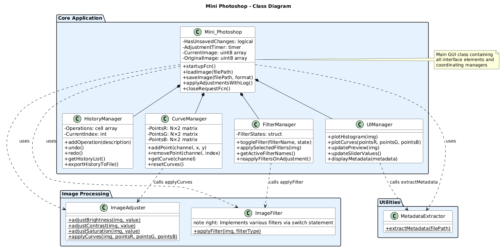

# Mini Photoshop

A MATLAB-based image editing application developed as a learning project for the Technical Computing & Programming for Engineers course at Beihang University (BUAA).

## Overview

Mini Photoshop is a graphical image editor built using MATLAB's GUI capabilities and the Image Processing Toolbox. It provides essential photo manipulation features while demonstrating modular programming principles and user interface design.

## Features

### Image Adjustments

- **Brightness, Contrast, Saturation**: Real-time adjustments using HSV color space
- **Gamma Correction**: Precise color control on individual RGB channels

### RGB Curve Editor

- Multi-channel curve editing (Red, Green, Blue, or RGB simultaneously)
- Interactive point manipulation with visual feedback
- Smooth spline interpolation for natural tonal transitions

### Filters

- Gaussian Blur and Sharpening
- Edge Detection (Sobel and Canny algorithms)
- Emboss effect
- Histogram Equalization
- Noise reduction with median filtering
- Automatic filter persistence through adjustments

### Geometric Transformations

- Rotation (90°, 180°, 270°)
- Horizontal and vertical flipping

### Additional Features

- **Multi-format Support**: JPEG, PNG, BMP, TIFF, GIF
- **History Management**: Unlimited undo/redo with detailed logging
- **EXIF Metadata Extraction**: Camera settings, lens info, and technical details
- **Exit Protection**: Unsaved changes detection with confirmation dialogs
- **Performance Optimizations**: Real-time preview and selective logging

## Screenshots

See the appendix of the [technical report](paper/report.pdf) for screenshots of the application interface.

## Requirements

- MATLAB R2023a or later
- Image Processing Toolbox
- For standalone executable: MATLAB Compiler toolbox (optional)

## Installation

1. Clone the repository:

   ```bash
   git clone https://github.com/fra2404/Mini_Photoshop.git
   cd Mini_Photoshop
   ```

2. Open MATLAB and navigate to the project directory

3. Run the application:
   ```matlab
   Mini_Photoshop
   ```

## Usage

1. **Loading Images**: Use File → Load Image to open supported image formats
2. **Adjustments**: Use sliders in the Adjustments tab for real-time modifications
3. **Curves**: Edit RGB curves in the Curves tab with point manipulation
4. **Filters**: Apply filters in the Filters tab
5. **History**: View operation history and use undo/redo in the History tab
6. **Metadata**: Check EXIF information in the Info tab
7. **Saving**: Export in various formats using File → Save As

For detailed usage instructions, see the User Guide section in the [technical report](paper/report.pdf).

## Architecture

The application follows a modular design with separate manager classes:

- **Mini_Photoshop.m**: Main application controller with GUI components
- **ImageAdjuster.m**: Core image processing algorithms
- **ImageFilter.m**: Filter implementations
- **HistoryManager.m**: Undo/redo functionality
- **CurveManager.m**: RGB curve manipulation
- **FilterManager.m**: Filter state management
- **UIManager.m**: Histogram and curve plotting
- **MetadataExtractor.m**: EXIF data extraction

### UML Class Diagram



_Visual representation of the application architecture showing the relationships between classes and their responsibilities._

## Documentation

- **[Technical Report](paper/report.pdf)**: Complete documentation including methodology, results, testing, and user guide

## Development

This project was developed as final part of the Technical Computing course requirements at Beihang University (BUAA).

## License

This project is licensed under the GNU General Public License v3.0 - see the [LICENSE](LICENSE) file for details.

## Acknowledgments

Developed as a course project for Technical Computing & Programming for Engineers at Beihang University (BUAA).
